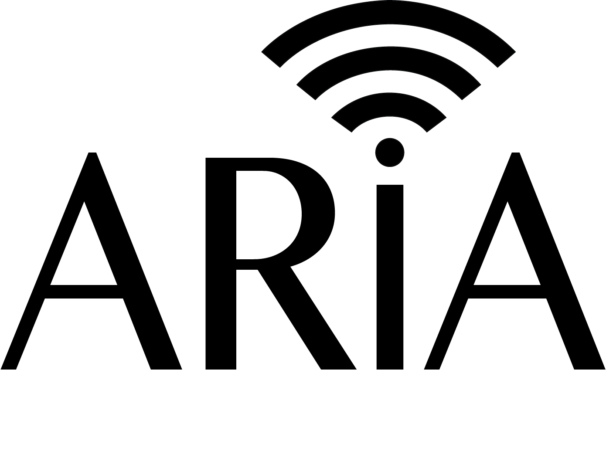

Aria - Autonomous Real-Time Interactive Architecture
====================================================

[](https://travis-ci.com/mattmaynes2/aria)



## Overview

Aria is a smart home automation system that learns from its environment and automatically automates
common actions. The Aria system uses a central hub to interconnect various smart devices through
multiple different communication mediums. The Aria hub uses smart sense through machine learning
to predict desired user interactions.

## Background

Any home maintenance task which can be automated can save the owner time and money. Automated
environmental control is not a novel concept; devices such as light timers and programmable
thermostats have existed for many years. Most of these common devices, however, must be configured
manually. The system proposed in this report is able to configure itself based on normal actions
taken by the user. By having the system learn the habits of the user dynamically, the
configuration is essentially eliminated, leading to an ease of installation that does not currently
exist.

## Required libraries

Installing openzwave python library

```
$ sudo apt-get install cython3 libudev-dev python3-sphinx python3-setuptools git
$ git clone https://github.com/OpenZWave/python-openzwave.git
$ cd python-openzwave
$ git checkout python3
$ PYTHON_EXEC=$(which python3) make build
$ sudo PYTHON_EXEC=$(which python3) make install
```

## Project Deployment

To build the Aria system, a set of automated build scripts are provided in the `./build` folder.
The `./build/run` script provides all the facilities for configuring the project environment,
installing dependencies, building and testing the project, and deployment. Below is the help
information to the `run` script.

```
  Usage: run [options] [command] <cmd> [option] [target]


  Commands:

    all [target]     Install dependencies, runs a build and tests it
    enviro [target]  Install environment dependencies
    deps [target]    Install project dependencies
    build [target]   Compile project and run build
    test [target]    Run tests on built projects
    deploy [target]  Starts running the built project
    clean [target]   Cleans the build resources

  Options:

    -h, --help        output usage information
    -V, --version     output the version number
    -a, --stay-alive  Continue to run the directive even if an error occurs
    -m, --manifest    Execute build with specific manifest
    -q, --quiet       Do not display output from commands being executed
    -S, --silent      Do not display any output
    -r, --root        Root directory where target should be executed from
    -s, --stats       Display build statistics at end of execution
    -v, --verbose     Display verbose messages
```

To build the entire project, simply run `./build/run all`. Finally, to deploy the system after it
has been build, run `./build/run deploy`.


